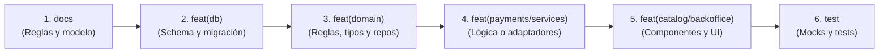

# Convenciones de Git y Commits en Aura Studio

Este documento define la política oficial de commits y control de versiones para todo el equipo y agentes de desarrollo. El objetivo es mantener un historial limpio, auditable, biseccionable (`git bisect`) y con trazabilidad directa hacia las **Reglas de Negocio (`BR-xx`)** y las **Reglas de Arquitectura (`AR-xx`)**.

---

## 1. Principio Fundamental: Commits Atómicos por Capa

> **Regla de oro:** Cada commit debe representar **una sola responsabilidad o cambio conceptual autónomo**.

**Nunca mezcles en un único commit:**
- Cambios de especificación/docs y código de implementación.
- Migraciones de base de datos y componentes de interfaz de usuario.
- Lógica de dominio pura y adaptadores de infraestructura o vistas.

Separar los commits por capa permite:
1. Revertir cambios de UI sin romper la persistencia de datos.
2. Auditar migraciones de base de datos de forma aislada.
3. Comprender el orden de construcción de una feature de principio a fin.

---

## 2. Formato del Mensaje de Commit

Seguimos una variante de **Conventional Commits** adaptada a nuestro sistema de reglas:

```text
<tipo>(<ámbito>): <descripción concisa en español y minúsculas> [(BR-xx | AR-xx)]
```

### Tipos permitidos

| Tipo | Cuándo se usa |
|---|---|
| `docs` | Actualización de documentación, especificaciones funcionales, modelo de datos o reglas. |
| `feat` | Nueva funcionalidad, cambio de modelo o ampliación de capacidades del sistema. |
| `fix` | Corrección de un defecto o comportamiento anómalo. |
| `refactor` | Reestructuración de código sin alterar su comportamiento externo ni añadir tests. |
| `test` | Incorporación o ajuste de tests unitarios, de integración, fixtures o datos mock. |
| `chore` | Tareas de tooling, dependencias, scripts de setup local o configuración de CI/CD. |

### Ámbitos (Scopes) del proyecto

| Ámbito | Módulos y directorios asociados |
|---|---|
| `(domain)` | Entidades, reglas puras, tipos, puertos en `src/domain/`. |
| `(db)` | Schemas Drizzle, migraciones SQL en `drizzle/`, repositorios en `src/infra/db/`. |
| `(services)` | Casos de uso y servicios en `src/services/`. |
| `(catalog)` | Catálogo público: grilla, ficha (`/p/[code]`), carrusel, filtros en `src/components/catalog/` y `src/app/`. |
| `(backoffice)` | Panel de administración privado, formularios de carga y edición en `src/app/admin/`. |
| `(payments)` | Adaptadores de pago y consulta en `src/infra/payments/` (WhatsApp, Mercado Pago). |
| `(analytics)` | Telemetría desacoplada en `src/components/analytics/` y `/api/analytics/track`. |
| `(auth)` | Autenticación, protección de fuerza bruta y sesiones en `src/infra/auth/`. |
| `(parser)` | Parser de texto libre, sanitización y formateadores en `src/lib/parser/` y `src/lib/format/`. |

---

## 3. Trazabilidad con Reglas (`BR-xx` y `AR-xx`)

Toda funcionalidad que implemente o modifique una regla de negocio o de arquitectura debe citar su código al final del mensaje:

- `feat(garments): código correlativo atómico sin reutilización (BR-01)`
- `feat(db): migración versionada para variantes de color (AR-05)`
- `feat(payments): incluir color y talle en mensaje de WhatsApp (BR-13)`
- `docs: actualizar ciclo de vida de agotado a 30 días (BR-03, BR-04)`

---

## 4. Secuencia Canónica para Features Transversales

Cuando se implementa una nueva funcionalidad que impacta en múltiples capas del sistema (ej: agregar variantes de color y stock por talle), los commits deben realizarse en este orden secuencial:



1. **`docs:`** Actualización de `business-rules.md`, `data-model.md`, `architecture.md` y `backoffice.md`.
2. **`feat(db):`** Nuevas tablas en Drizzle (`schema.ts`) y migración versionada (`drizzle/migrations/xxxx.sql`).
3. **`feat(domain):`** Tipos TypeScript, validaciones en `rules.ts` y métodos de repositorio/servicio.
4. **`feat(payments | services):`** Adaptadores o casos de uso derivados.
5. **`feat(catalog | backoffice):`** Componentes interactivos, páginas y estilos.
6. **`test:`** Fixtures, seeds de desarrollo local (`setup-local.ts`) y suites de prueba en `tests/`.

---

## 5. Checklist antes de commitear

- [ ] ¿El commit hace una sola cosa bien definida?
- [ ] ¿Los tests pasan en verde (`npm test`)?
- [ ] ¿La compilación y tipos de TypeScript están limpios (`npm run build` o `npx tsc --noEmit`)?
- [ ] ¿El mensaje sigue la estructura `<tipo>(<ámbito>): <descripción> [(BR-xx)]`?
- [ ] ¿Evitaste commitear archivos temporales, logs o claves secretas?
